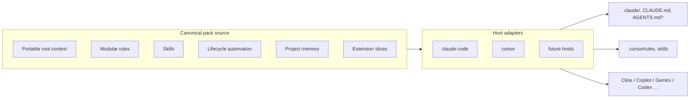

---
stepsCompleted:
  - 1
inputDocuments:
  - _bmad-output/planning-artifacts/prd.md
  - _bmad-output/planning-artifacts/product-brief-claude-md-configuration-library.md
  - _bmad-output/planning-artifacts/research/domain-agent-context-claude-cursor-gemini-research-2026-04-03.md
  - docs/market_scan.md
workflowType: architecture
project_name: clean-code
prd_working_name: vibeforge
user_name: Simon
date: "2026-04-03"
uxDesign: none
uxNote: >-
  User confirmed: no separate UX design for this product — terminal CLI installer only.
  PRD "UI" content applies to emitted packs for target repos, not to a GUI for the installer itself.
---

# Architecture Decision Document

_This document builds collaboratively through step-by-step discovery. Sections are appended as we work through each architectural decision together._

## Architecture decision records

| ADR | Title | Status |
|-----|--------|--------|
| [ADR-0001](./adr/0001-installer-runtime-node-npx.md) | Installer runtime — Node.js and npx | Accepted (2026-04-03) |

## Alignment with PRD (maintained with `prd.md`)

This section keeps **architecture** and **`epics.md`** consistent when the PRD changes. Last reviewed against PRD **2026-04-03**.

### Naming and scope

- **PRD title / working name:** **vibeforge** (replaces earlier “clean-code” wording in the PRD document). Repository BMM config may still use `project_name: clean-code`; use the **PRD working name** for customer-facing narrative and new docs.
- **Product definition (executive summary):** A **versioned library** of **coding agent context, hooks, and skills packs** expressed as a **small set of canonical interoperable artifact types** (see below) materialized through **host adapters** for **vibe coding agents**. Example roadmap hosts include **Claude Code**, **Cursor**, **Cline**, **GitHub Copilot**, **VS Code Copilot**, **OpenAI Codex CLI**, **Google Gemini CLI**, **Windsurf**, and BMAD-taxonomy peers. **MVP** ships adapters for **Claude Code + Cursor** only; others follow **FR-MAP-02 / FR30–FR31** when tested.

### Installer shape (BMAD parity)

- **Normative PRD commands (MVP installer):** `load`, `check`, **`resolve-defaults`**, `write` — same interaction model as BMAD `bmad_init` flows (YAML-driven prompts, merged config artifact). Architecture and stories **must** include **`resolve-defaults`** (or equivalent exposed subcommand) in BMAD parity, not only `check`/`write`/`load` shorthand.
- **Runtime (PRD + ADR aligned):** **FR-INST-01** and developer-tool tables specify **Node.js (LTS)**, **npm**, and **`npx`**; **ADR-0001** matches. Journey 5 example uses **`npx <cli>`**. Offline path documented per FR-INST-01 / FR5.

### Growth hosts

- **FR-MAP-02 (PRD):** **Cline**, **Windsurf**, **GitHub Copilot**, **VS Code Copilot**, **OpenAI Codex CLI**, **Google Gemini CLI** — BMAD MCP taxonomy; **distinct adapter rows** where Copilot surfaces differ materially. **Codex:** single row; **[oh-my-codex (OMX)](https://github.com/sdk451/oh-my-codex)** documented as **optional companion** in pack docs (supplements runtime; forge supplements **repo guidance** via `AGENTS.md`).
- **Epics backlog:** `epics.md` **productOwnerNotes** may list hosts (e.g. Kimi Code, Microsoft Copilot) before full PRD rows exist; architecture treats them as **roadmap** until adapters are specified and tested.

### Post-MVP extension (blocked on external OSS)

- **FR42:** **Agent-agnostic configurable quality verification layer** — separate **open-source** product (not this repo). Architecture reserves a **pack slice + manifest hook** only; **no MVP dependency**. When the OSS product GA’s, add adapter logic to emit **default** verification wiring (policies, evidence, gate substitutes per host).

### Unchanged contract (increment)

- **FR1–FR42** (FR42 future/conditional) and **NFR-P1–NFR-I2** in the current PRD should match **`epics.md`** (including **FR36–FR41** **UI/UX design & implementation extension pack**; **FR42** placeholder; cross-tool **Non-functional** bullets: golden repo + CI smoke, no answer exfiltration, scoped optional packs).

---

## Canonical artifact model & host adapters

**Intent:** Avoid N×M ad-hoc file copies. **Pack source** defines **canonical** sections (stable IDs, merge order, optional composition). **Adapters** translate each slice into **host-native** paths and formats.

- **Portable root context:** Prefer emitting **[AGENTS.md](https://agents.md/)** when teams want **cross-tool** readability; always allow **host-optimized** parallel files (`CLAUDE.md`, `GEMINI.md`, etc.) from the **same** canonical body (FR-MAP-01).
- **Adapter interface (conceptual):** `emit(canonicalSlice, hostId, answers) → files[]` with **golden snapshots** per host in CI (NFR-R1/R2).
- **Gap table:** Each adapter publishes **hook substitutes**, **memory substitute**, and **skills discovery** differences (FR12–FR13).

**Primary reference:** PRD **FR-MAP-01**; evidence and citations: **domain research** (`domain-agent-context-claude-cursor-gemini-research-2026-04-03.md`, esp. §7 matrix, §9 supplementary).

---

## Extension pack architecture

| Pack layer | Role | PRD |
|------------|------|-----|
| **Base stack** | Language/framework profile; composes canonical rows | FR6, FR10–FR11 |
| **UI/UX workflow** | **Named extension:** Figma MCP, Storybook, Playwright/MCP, shadcn-oriented conventions | FR36–FR41 |
| **Quality verification (future)** | **Default-aligned** integration with **external OSS** quality layer | FR42 (post-MVP) |

Optional packs **compose** onto base manifests; questionnaire flags (e.g. `include_ui_workflow_pack`) control emission without forking core CLI (FR27).

---

## Domain research traceability

Consolidated report: `_bmad-output/planning-artifacts/research/domain-agent-context-claude-cursor-gemini-research-2026-04-03.md`. Use it for **template spec** (Epic 1), **AGENTS.md precedence**, **root-cause / compaction** wording, and **UI verification** patterns when implementing adapters and pack authors’ guides.
